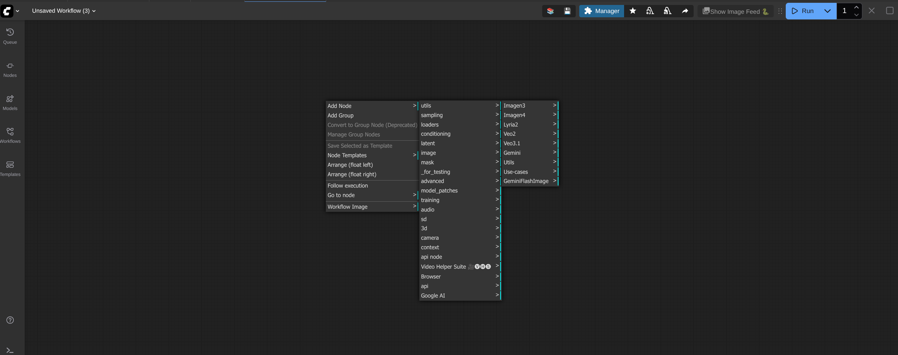

This is not an officially supported Google product. This project is not
eligible for the [Google Open Source Software Vulnerability Rewards
Program](https://bughunters.google.com/open-source-security).

This is a preview version of Google GenAI custom nodes for ComfyUI.

# ComfyUI custom nodes for Google GenMedia

This repository contains ComfyUI custom nodes for the following Google GenMedia models:
- Gemini
- Gemini 2.5 Flash Image(Nano Banana 🍌)
- Imagen3
- Imagen4
- Lyria2
- Veo2
- Veo3.1
- Virtual-try-on

All of these nodes need a Google Cloud project and region as input and uses the Vertex AI APIs to access Google GenMedia models. If you are running ComfyUI on GKE as described in [ComfyUI on GKE](https://github.com/GoogleCloudPlatform/accelerated-platforms/tree/main/platforms/gke/base/use-cases/inference-ref-arch/examples/comfyui) guide, the Vertex AI APIs will be authenticated with [GKE workload identity](https://cloud.google.com/kubernetes-engine/docs/how-to/workload-identity) and no additional action is required form your end.

If you are running your own(local) ComfyUI installation, you will need to install the custom nodes and authenticate to Google Cloud as an user or a Service Account. See [installation](##usage) section for details.


## Installing the Google Generative Media custom nodes

### ComfyUI on GKE
If you want to run ComfyUI on GKE and use these custom nodes, follow the [ComfyUI on GKE](https://github.com/GoogleCloudPlatform/accelerated-platforms/tree/main/platforms/gke/base/use-cases/inference-ref-arch/examples/comfyui) guide that will spin up ComfyUI on GKE with these custom nodes installed and ready to use.


### ComfyUI running locally
 If you are running ComfyUI locally or at a place other than GCP and want to use these custom nodes, you need to perform the following steps to install them:

1. Download these custom nodes in one of the following ways:
     - **Using the ComfyUI Manager**
       - Go to ComfyUI Manager --> Custom Node Manager --> search for `google_genmedia`. Click Install.

     - **Manual installation using git**
       - Open the terminal on the machine that is running ComfyUI and change to the directory where ComfyUI is running from.
            ```sh
            cd <PATH_TO_COMFYUI_INSTALLATION>

            E.g if your ComfyUI is running from "/home/user/username/ComfyUI", replace <PATH_TO_COMFYUI_INSTALLATION> with "/home/user/username/"
            ```
       - Change to the custom_nodes folder.
         ```sh
          cd ComfyUI/custom_nodes
          ```
          
       - Clone this repository in the custom_nodes folder:
         ```sh
         git clone https://github.com/GoogleCloudPlatform/comfyui-google-genmedia-custom-nodes
         ```
       - Install python packages:
          1. If you are running ComfyUI in a python virtual environment, activate it before installing the dependencies.
              ```shREADME.md
                source <PATH_TO_PYTHON_VIRTUAL_ENVIRONMENT>/bin/activate
              ```
          2. Install python packages
              ```sh
              pip install -r comfyui-google-genmedia-custom-nodes/requirements.txt
              ```

2. Now that the custom nodes are installed, set up authentication with Google Cloud. This is needed because the custom nodes will use Vertex AI APIs in the given Google Cloud project and region. Choose one of the following authentication methods:
    - [Authenticate local ComfyUI with Google Cloud user](#authenticate-local-comfyui-with-google-cloud-user)
    - [Authenticate local ComfyUI with Google Cloud Service Accountt](#authenticate-local-comfyui-with-google-cloud-service-account)

3. Re-start ComfyUI via ComfyUI manager or manually. Verify there are no failures in the logs and the log says that google-genmedia custom node has been loaded successfully, similar to the following message:
   ```sh
   Import times for custom nodes:
	  .....
      .....
      .....
      2.8 seconds: /home/comfyuser/comfy/ComfyUI/custom_nodes/google-genmedia
   ```
4. You are all set! Start using the custom nodes. Right click on ComfyUI, Click the 'Add node' menu and you should see a category named `Google AI` with custom nodes for Google’s genmedia models as shown in the image below. **You will need to pass a GCP project id and GCP region as input parameter to every node if you are using the custom nodes from your local ComfyUI installation**.
 
1. **Optional step** : If you are not familiar with Google's GenMedia custom nodes, we provide some sample workflows with this repo that shows how to use the nodes. You can download and use the sample workflows by following the steps in [Sample Workflows](#sample-workflows) section. For full set of features and input parameters to each node, see [Node features ](#node-features)section for more details.
   

#### Authenticate local ComfyUI with Google Cloud user
- On the machine where you are running ComfyUI, install gcloud cli using the documentation https://docs.cloud.google.com/sdk/docs/install
- Authenticate with the following command. Enter your Google Cloud credentials when prompted:
  ```sh
    gcloud auth application-default login
  ```

#### Authenticate local ComfyUI with Google Cloud Service Account
- On the machine where you are running ComfyUI, install gcloud cli using the documentation https://docs.cloud.google.com/sdk/docs/install
- Authenticate with the following command. Enter your Google Cloud credentials when prompted:
    ```sh
     gcloud auth login
    ```
- Set shell variables
    ```sh
    export PROJECT_ID="<YOUR_PROJECT_ID>"
    export SERVICE_ACCOUNT_ID="<YOUR_SERVICE_ACCOUNT_ID>"
    export USER_EMAIL=`gcloud auth list --filter=status:ACTIVE --format="value(account)"`

    Replace <YOUR_PROJECT_ID> with the GCP project id you plan to use
    Replace <YOUR_SERVICE_ACCOUNT_ID> with the name of the service account you will use to access Google Cloud with ComfyUI. It will be created in the next step.
    ```
- Set Google Cloud project.
    ```sh
    gcloud config set project $PROJECT_ID
    ```
- Create a new service account:
    ```sh
    gcloud iam service-accounts create $SERVICE_ACCOUNT_ID \
    --display-name="ComfyUI Service Account" \
    --description="Service Account to use ComfyUI"
    ```
- Grant permissions to the service account:
    ```sh
    gcloud projects add-iam-policy-binding $PROJECT_ID \
    --member="serviceAccount:${SERVICE_ACCOUNT_ID}@${PROJECT_ID}.iam.gserviceaccount.com" \
    --role="roles/storage.objectUser" --condition=None

    gcloud projects add-iam-policy-binding $PROJECT_ID \
    --member="serviceAccount:${SERVICE_ACCOUNT_ID}@${PROJECT_ID}.iam.gserviceaccount.com" \
    --role="roles/aiplatform.user" --condition=None
    ```
- Grant the Service Account Token Creator role to your user on the service account. This role lets your user account to impersonate the Service Account created in previous steps: 
    ```sh
    gcloud iam service-accounts add-iam-policy-binding \
    ${SERVICE_ACCOUNT_ID}@${PROJECT_ID}.iam.gserviceaccount.com \
    --member="user:${USER_EMAIL}" \
    --role="roles/iam.serviceAccountTokenCreator"
    ```
- Now, set yourself to impersonate the service account
  ```sh
  gcloud auth application-default login --impersonate-service-account=${SERVICE_ACCOUNT_ID}@${PROJECT_ID}.iam.gserviceaccount.com
  ```

## Node features

### Gemini 2.5 Custom Node

Category: `Google AI/Gemini`

This node integrates the Gemini 2.5 into ComfyUI, supporting text generation only with multimodal inputs (image, video, audio).

#### Required Inputs

| Parameter | Type | Default | Description |
| :--- | :--- | :--- | :--- |
| **prompt** | `STRING` | _"Describe the content in detail."_ | Multiline string. The main text prompt for the model. |
| **model** | `Dropdown` | `GEMINI_PRO` | Selects the specific Gemini model to use. |
| **temperature** | `FLOAT` | `0.7` | Controls randomness (0.0 to 1.0). Higher values are more creative; lower are more deterministic. |
| **max_output_tokens** | `INT` | `8192` | The maximum number of tokens to generate in the response (Max: 8192). |
| **top_p** | `FLOAT` | `1.0` | The maximum cumulative probability of tokens to consider (0.0 to 1.0). |
| **top_k** | `INT` | `32` | The maximum number of tokens to consider when generating the next token (1 to 64). |
| **candidate_count** | `INT` | `1` | Number of alternative responses to generate (1 to 8). |
| **stop_sequences** | `STRING` | `""` | Comma-separated phrases that cause the model to stop generating text. |
| **response_mime_type**| `String` | `text/plain` | The desired format of the response. **Options:** `text/plain`, `application/json`. |
| **harassment_thresholds** | `Dropdown` | `BLOCK_MEDIUM_AND_ABOVE` | Individual settings for Harassment Content. |
| **hate_speech_thresholds** | `Dropdown` | `BLOCK_MEDIUM_AND_ABOVE` | Individual settings for Content. |
| **sexually_explicit_thresholds** | `Dropdown` | `BLOCK_MEDIUM_AND_ABOVE` | Individual settings for Sexually Explicit Content. |
| **dangerous_content_thresholds** | `Dropdown` | `BLOCK_MEDIUM_AND_ABOVE` | Individual settings  Dangerous Content. |
| **gcp_project_id** | `STRING` | `""` | Manually specify GCP Project ID. |
| **gcp_region** | `STRING` | `""` | Manually specify GCP Region.|

#### Optional Inputs

| Parameter | Type | Default | Description |
| :--- | :--- | :--- | :--- |
| **system_instruction** | `STRING` | `""` | Multiline string. System instructions to guide the model's behavior or persona. |
| **image_file_path** | `STRING` | `""` | Absolute path to an image file (e.g., `output/file.png`). |
| **image_mime_type** | `Dropdown` | `image/png` | Helper to specify the MIME type for the image path provided. |
| **video_file_path** | `STRING` | `""` | Absolute path to a video file (e.g., `output/file.mp4`). |
| **video_mime_type** | `Dropdown` | `video/mp4` | Helper to specify the MIME type for the video path provided. |
| **audio_file_path** | `STRING` | `""` | Absolute path to an audio file (e.g., `output/file.mp3`). |
| **audio_mime_type** | `Dropdown` | `audio/mp3` | Helper to specify the MIME type for the audio path provided. |

#### Outputs

| Name | Type | Description |
| :--- | :--- | :--- |
| **generated_output** | `STRING` | The raw text content generated by the Gemini model. |

### Imagen 3 Custom Node

Category: `Google AI/Imagen3`

This node provides an interface to the Imagen3 for text-to-image generation. 

#### Required Inputs

| Parameter | Type | Default | Description |
| :--- | :--- | :--- | :--- |
| **prompt** | `STRING` | `A vivid landscape painting of a futuristic city.` | The text description of the image you want to generate. |
| **person_generation** | `DROPDOWN` | `ALLOW_ADULT` | Controls whether the model can generate people (e.g., "allow_adult", "dont_allow"). |
| **aspect_ratio** | `DROPDOWN` | `16:9` | The desired aspect ratio of the generated images. Options : `1:1`, `3:4`, `4:3`, `9:16`, `16:9`. |
| **number_of_images** | `INT` | `1` | The number of images to generate. **Min:** 1, **Max:** 4. |
| **seed** | `INT` | `0` | Seed for reproducibility. If set to **0**, the Imagen3 API handles randomness automatically.  **Note:** Not supported if `enhance_prompt` is enabled. |
| **enhance_prompt** | `BOOLEAN` | `True` | If true, the model will automatically rewrite your prompt for better quality. **Note:** Disables `seed`. |
| **add_watermark** | `BOOLEAN` | `False` | If true, adds a watermark to the output.  |
| **output_image_type** | `Dropdown` | `PNG` | The file format of the generated image. **Options:** `PNG`, `JPEG`. |
| **safety_filter_level** | `STRING` | `BLOCK_MEDIUM_AND_ABOVE` | Strictness of the safety filter (e.g., "BLOCK_NOCE", BLOCK_ONLY_HIGH"). |
| **project_id** | `STRING` | `""` | Manually specify GCP Project ID. |
| **region** | `STRING` | `""` | Manually specify GCP Region. |

#### Optional Inputs

| Parameter | Type | Default | Description |
| :--- | :--- | :--- | :--- |
| **negative_prompt** | `STRING` | `""` | Text description of what to exclude from the image. |

#### Outputs

| Name | Type | Description |
| :--- | :--- | :--- |
| **images** | `IMAGE` | A list of PIL Image objects representing the generated content. |

### Imagen 4 Custom Node

Category: `Google AI/Imagen4`

This node provides an interface to the Imagen4 for high-quality text-to-image generation. 

#### Required Inputs

| Parameter | Type | Default | Description |
| :--- | :--- | :--- | :--- |
| **model** | `Dropdown` | `IMAGEN_4_PREVIEW` | Selects the specific Imagen4 model version to use. |
| **prompt** | `STRING` | `A vivid landscape painting of a futuristic city.` | Multiline string. The main text description for the image generation. |
| **person_generation** | `Dropdown` | `allow_adult` | Controls if the model generates people. **Options:** `allow_adult`, `dont_allow`. |
| **aspect_ratio** | `Dropdown` | `16:9` | The aspect ratio of the generated images. **Options:** `1:1`, `16:9`, `4:3`, `3:4`, `9:16`. |
| **number_of_images** | `INT` | `1` | The number of images to generate per request. **Min:** 1, **Max:** 4. |
| **seed** | `INT` | `0` | Seed for reproducibility. If set to **0**, the Imagen4 API handles randomness automatically.  **Note:** Not supported if `enhance_prompt` is enabled.|
| **enhance_prompt** | `BOOLEAN` | `True` | If true, the model automatically rewrites/improves your prompt for better quality. **Note:** Disables `seed`. |
| **add_watermark** | `BOOLEAN` | `False` | If true, adds an invisible digital watermark to the output. |
| **output_image_type** | `Dropdown` | `PNG` | Format requested from the API before conversion to tensor. **Options:** `PNG`, `JPEG`. |
| **safety_filter_level** | `Dropdown` | `BLOCK_MEDIUM_AND_ABOVE` | Strictness of safety filters (e.g., `BLOCK_ONLY_HIGH`, `BLOCK_NONE`). |
| **gcp_project_id** | `STRING` | `""` | Manually specify GCP Project ID. |
| **gcp_region** | `STRING` | `""` | Manually specify GCP Region. |

#### Optional Inputs

| Parameter | Type | Default | Description |
| :--- | :--- | :--- | :--- |
| **negative_prompt** | `STRING` | `""` | Text description of elements to exclude from the image. |


#### Outputs

| Name | Type | Description |
| :--- | :--- | :--- |
| **Generated Image** | `IMAGE` | A batch of images (torch tensors) ready for use in ComfyUI. |

### Veo2 Custom Nodes

#### 1. Veo2 Text To Video

Category: `Google AI/Veo2`

Generates videos purely from text prompts using the Google Veo 2.0.

#### Required Inputs

| Parameter | Type | Default | Description |
| :--- | :--- | :--- | :--- |
| **prompt** | `STRING` | _N/A_ | Multiline string. The main text description for the video generation. |
| **aspect_ratio** | `Dropdown` | `16:9` | The aspect ratio of the generated video. **Options:** `16:9`, `9:16`. |
| **compression_quality** | `Dropdown` | `optimized` | Video quality setting. **Options:** `optimized` (standard), `lossless` (requires `output_gcs_uri` input parameter). |
| **person_generation** | `Dropdown` | `allow_adult` | Controls if the model generates people. **Options:** `allow_adult`, `dont_allow`. |
| **duration_seconds** | `INT` | `8` | Length of video in seconds. **Min:** 5, **Max:** 8. |
| **enhance_prompt** | `BOOLEAN` | `True` | If true, the model automatically improves your prompt. **Note:** Disables seed |
| **sample_count** | `INT` | `1` | Number of video samples to generate. **Min:** 1, **Max:** 4. |
| **seed** | `INT` | `0` | Seed for reproducibility. If set to **0**, the Veo API handles randomness automatically.  **Note:** Not supported if `enhance_prompt` is enabled. |
| **gcp_project_id** | `STRING` | `""` | Manually specify GCP Project ID. |
| **gcp_region** | `STRING` | `""` | Manually specify GCP Region. |

#### Optional Inputs

| Parameter | Type | Default | Description |
| :--- | :--- | :--- | :--- |
| **negative_prompt** | `STRING` | `""` | Text description of elements to avoid in the video. |
| **output_gcs_uri** | `STRING` | `""` | GCS path to save the video. Required if `compression_quality` is `lossless`. |

#### Outputs

| Name | Type | Description |
| :--- | :--- | :--- |
| **video_paths** | `VEO_VIDEO` | A list of file paths to the generated videos. |

---

#### 2. Veo2 Image To Video (GcsUriImage)

Category: `Google AI/Veo2`

Generates videos using an image stored on Google Cloud Storage (GCS) as the starting frame.

#### Required Inputs

| Parameter | Type | Default | Description |
| :--- | :--- | :--- | :--- |
| **gcsuri** | `STRING` | `""` | **Required**. The `gs://` URI path to the input image. |
| **image_format** | `Dropdown` | `PNG` | The MIME type/format of the input image. **Options:** `PNG`, `JPEG`, `MP4`. |
| **prompt** | `STRING` | _N/A_ | Multiline string. Text description to guide the animation/video. |
| **aspect_ratio** | `Dropdown` | `16:9` | The aspect ratio of the generated video. **Options:** `16:9`, `9:16`. |
| **compression_quality** | `Dropdown` | `optimized` | Video quality setting. **Options:** `optimized` (standard), `lossless` (requires `output_gcs_uri` input parameter). |
| **person_generation** | `Dropdown` | `allow_adult` | Controls if the model generates people. **Options:** `allow_adult`, `dont_allow`. |
| **duration_seconds** | `INT` | `8` | Length of video in seconds. **Min:** 5, **Max:** 8. |
| **enhance_prompt** | `BOOLEAN` | `True` | If true, automatically improves the prompt. **Note**: Disables seed |
| **sample_count** | `INT` | `1` | Number of video samples to generate. **Min:** 1, **Max:** 4. |
| **seed** | `INT` | `0` | Seed for reproducibility. If set to **0**, the Veo API handles randomness automatically.  **Note:** Not supported if `enhance_prompt` is enabled. |
| **gcp_project_id** | `STRING` | `""` | Manually specify GCP Project ID. |
| **gcp_region** | `STRING` | `""` | Manually specify GCP Region. |

#### Optional Inputs

| Parameter | Type | Default | Description |
| :--- | :--- | :--- | :--- |
| **last_frame_gcsuri** | `STRING` | `""` | The `gs://` URI for a final frame image (for interpolation). |
| **output_gcs_uri** | `STRING` | `""` | GCS path to save output. Required if `compression_quality` is `lossless`. |
| **negative_prompt** | `STRING` | `""` | Text description of elements to avoid in the video. |


#### Outputs

| Name | Type | Description |
| :--- | :--- | :--- |
| **video_paths** | `VEO_VIDEO` | A list of file paths to the generated videos. |

---

#### 3. Veo2 Image To Video (Tensor)

Category: `Google AI/Veo2`

Generates videos using a ComfyUI image tensor (passed from another node) as the starting frame.

#### Required Inputs

| Parameter | Type | Default | Description |
| :--- | :--- | :--- | :--- |
| **image** | `IMAGE` | _N/A_ | The input image tensor from ComfyUI. |
| **image_format** | `Dropdown` | `PNG` | The format hint for the API processing. **Options:** `PNG`, `JPEG`, `MP4`. |
| **prompt** | `STRING` | _N/A_ | Multiline string. Text description to guide the animation. |
| **aspect_ratio** | `Dropdown` | `16:9` | The aspect ratio of the generated video. **Options:** `16:9`, `9:16`. |
| **compression_quality** | `Dropdown` | `optimized` | Video quality setting. **Options:** `optimized` (standard), `lossless` (requires `output_gcs_uri` input parameter). |
| **person_generation** | `Dropdown` | `allow_adult` | Controls if the model generates people. **Options:** allow_adult, dont_allow. |
| **duration_seconds** | `INT` | `8` | Length of video in seconds. **Min:** 5, **Max:** 8. |
| **enhance_prompt** | `BOOLEAN` | `True` | If true, automatically improves the prompt. **Note:** Disables seed. |
| **sample_count** | `INT` | `1` | Number of video samples to generate. **Min:** 1, **Max:** 4. |
| **seed** | `INT` | `0` | Seed for reproducibility. If set to **0**, the Veo API handles randomness automatically.  **Note:** Not supported if `enhance_prompt` is enabled. |
| **gcp_project_id** | `STRING` | `""` | Manually specify GCP Project ID. |
| **gcp_region** | `STRING` | `""` | Manually specify GCP Region. |

#### Optional Inputs

| Parameter | Type | Default | Description |
| :--- | :--- | :--- | :--- |
| **last_frame** | `STRING` | `""` | An image tensor to use as the final frame for interpolation. |
| **output_gcs_uri** | `STRING` | `""` | GCS path to save output. Required if `compression_quality` is `lossless`. |
| **negative_prompt** | `STRING` | `""` | Text description of elements to avoid in the video. |

#### Outputs

| Name | Type | Description |
| :--- | :--- | :--- |
| **video_paths** | `VEO_VIDEO` | A list of file paths to the generated videos. |

### Veo 3.1 Custom Nodes

#### Veo3.1 Text to Video 

Category: `Google AI/Veo3.1`

Generates videos purely from text prompts using the Google Veo 3.1.

#### Required Inputs

| Parameter | Type | Default | Description |
| :--- | :--- | :--- | :--- |
| **model** | `Dropdown` | `VEO_3_1_PREVIEW` | Select the specific Veo 3 model version. |
| **prompt** | `STRING` | _N/A_ | Multiline string. The main text description for the video generation. |
| **aspect_ratio** | `Dropdown` | `16:9` | The aspect ratio of the generated video. **Options:** `16:9`, `9:16`. |
| **output_resolution**| `Dropdown` | `720p` | Resolution of the output video. **Options:** `720p`, `1080p`. |
| **compression_quality** | `Dropdown` | `optimized` | Video quality setting. **Options:** `optimized` (standard), `lossless` (requires `output_gcs_uri` input parameter). |
| **person_generation** | `Dropdown` | `allow_adult` | Controls if the model generates people. **Options:** `allow_adult`, `dont_allow`. |
| **duration_seconds** | `INT` | `8` | Length of video in seconds. **Min:** 4, **Max:** 8, **Step:** 2. |
| **generate_audio** | `BOOLEAN` | `True` | If true, generates a soundtrack for the video. |
| **sample_count** | `INT` | `1` | Number of video samples to generate. **Min:** 1, **Max:** 4. |
| **seed** | `INT` | `0` | Seed for reproducibility. If set to **0**, the Veo API handles randomness automatically.  **Note:** Not supported if `enhance_prompt` is enabled. Disabling `enhance_prompt` is not allowed in Veo3.1. |
| **gcp_project_id** | `STRING` | `""` | Manually specify GCP Project ID. |
| **gcp_region** | `STRING` | `""` | Manually specify GCP Region. |

#### Optional Inputs

| Parameter | Type | Default | Description |
| :--- | :--- | :--- | :--- |
| **output_gcs_uri** | `STRING` | `""` | GCS path to save the video. Required if `compression_quality` is `lossless`. |
| **negative_prompt** | `STRING` | `""` | Text description of elements to avoid in the video. |


#### Outputs

| Name | Type | Description |
| :--- | :--- | :--- |
| **video_paths** | `VEO_VIDEO` | A list of file paths to the generated videos. |

---

#### 2. Veo3.1 Image To Video (GcsUriImage)

Category: `Google AI/Veo3.1`

Generates videos using an image stored on Google Cloud Storage (GCS) as the starting frame.

#### Required Inputs

| Parameter | Type | Default | Description |
| :--- | :--- | :--- | :--- |
| **model** | `Dropdown` | `VEO_3_1_PREVIEW` | Select the specific Veo 3 model version. |
| **gcsuri** | `STRING` | `""` | The `gs://` URI path to the input image. |
| **image_format** | `Dropdown` | `PNG` | The format of the input image. **Options:** `PNG`, `JPEG`, `MP4`. |
| **prompt** | `STRING` | _N/A_ | Multiline string. Text description to guide the animation. |
| **aspect_ratio** | `Dropdown` | `16:9` | The aspect ratio of the generated video. **Options:** `16:9`, `9:16`. |
| **output_resolution**| `Dropdown` | `720p` | Resolution of the output video. **Options:** `720p`, `1080p`. |
| **compression_quality**| `Dropdown` | `optimized` | Video quality. **Options:** `optimized`, `lossless`. |
| **person_generation** | `Dropdown` | `allow_adult` | Controls if the model generates people. **Options:** `allow_adult`, `dont_allow`. |
| **duration_seconds** | `INT` | `8` | Length of video in seconds. **Min:** 4, **Max:** 8, **Step:** 2. |
| **generate_audio** | `BOOLEAN` | `True` | If true, generates a soundtrack for the video. |
| **sample_count** | `INT` | `1` | Number of video samples to generate. **Min:** 1, **Max:** 4. |
| **seed** | `INT` | `0` | Seed for reproducibility. If set to **0**, the Veo API handles randomness automatically.  **Note:** Not supported if `enhance_prompt` is enabled. Disabling `enhance_prompt` is not supported in Veo3.1. |
| **gcp_project_id** | `STRING` | `""` | Manually specify GCP Project ID. |
| **gcp_region** | `STRING` | `""` | Manually specify GCP Region. |

#### Optional Inputs

| Parameter | Type | Default | Description |
| :--- | :--- | :--- | :--- |
| **last_frame_gcsuri** | `STRING` | `""` | The `gs://` URI for a final frame image (for interpolation). |
| **output_gcs_uri** | `STRING` | `""` | GCS path to save output. Required if `compression_quality` is `lossless`. |
| **negative_prompt** | `STRING` | `""` | Text description of elements to avoid in the video. |

#### Outputs

| Name | Type | Description |
| :--- | :--- | :--- |
| **video_paths** | `VEO_VIDEO` | A list of file paths to the generated videos. |

#### 3. Veo3.1 Image To Video (Tensor)

Category: `Google AI/Veo3.1`

Generates videos using a ComfyUI image tensor (passed from another node) as the starting frame.

#### Required Inputs

| Parameter | Type | Default | Description |
| :--- | :--- | :--- | :--- |
| **model** | `Dropdown` | `VEO_3_1_PREVIEW` | Select the specific Veo 3 model version. |
| **image** | `IMAGE` | _N/A_ | The input image tensor from ComfyUI. |
| **image_format** | `Dropdown` | `PNG` | Format hint for the API. **Options:** `PNG`, `JPEG`, `MP4`. |
| **prompt** | `STRING` | _N/A_ | Multiline string. Text description to guide the animation. |
| **aspect_ratio** | `Dropdown` | `16:9` | The aspect ratio of the generated video. **Options:** `16:9`, `9:16`. |
| **output_resolution**| `Dropdown` | `720p` | Resolution of the output video. **Options:** `720p`, `1080p`. |
| **compression_quality**| `Dropdown` | `optimized` | Video quality. **Options:** `optimized`, `lossless`. |
| **person_generation** | `Dropdown` | `allow_adult` | Controls if the model generates people. **Options:** `allow_adult`, `dont_allow`. |
| **duration_seconds** | `INT` | `8` | Length of video in seconds. **Min:** 4, **Max:** 8, **Step:** 2. |
| **generate_audio** | `BOOLEAN` | `True` | If true, generates a soundtrack for the video. |
| **sample_count** | `INT` | `1` | Number of video samples to generate. **Min:** 1, **Max:** 4. |
| **seed** | `INT` | `0` | Seed for reproducibility. If set to **0**, the Veo API handles randomness automatically.  **Note:** Not supported if `enhance_prompt` is enabled. Disabling `enhance_prompt` is not supported in Veo3.1. |
| **gcp_project_id** | `STRING` | `""` | Manually specify GCP Project ID. |
| **gcp_region** | `STRING` | `""` | Manually specify GCP Region. |

#### Optional Inputs

| Parameter | Type | Default | Description |
| :--- | :--- | :--- | :--- |
| **last_frame** | `IMAGE` | _N/A_ | An image tensor to use as the final frame for interpolation. |
| **output_gcs_uri** | `STRING` | `""` | GCS path to save output. Required if `compression_quality` is `lossless`. |
| **negative_prompt** | `STRING` | `""` | Text description of elements to avoid in the video. |

#### Outputs

| Name | Type | Description |
| :--- | :--- | :--- |
| **video_paths** | `VEO_VIDEO` | A list of file paths to the generated videos. |

---

#### 4. Veo3.1 Reference To Video

Category: `Google AI/Veo3.1`

Generates videos using multiple reference images to guide the style and content.

#### Required Inputs

| Parameter | Type | Default | Description |
| :--- | :--- | :--- | :--- |
| **model** | `Dropdown` | `VEO_3_1_PREVIEW` | Select the specific Veo 3 model version. |
| **image1** | `IMAGE` | _N/A_ | The primary reference image tensor. |
| **image_format** | `Dropdown` | `PNG` | Format hint for the API. **Options:** `PNG`, `JPEG`. |
| **prompt** | `STRING` | _N/A_ | Multiline string. Text description to guide the animation. |
| **aspect_ratio** | `Dropdown` | `16:9` | The aspect ratio of the generated video. **Options:** `16:9`, `9:16`. |
| **output_resolution**| `Dropdown` | `720p` | Resolution of the output video. **Options:** `720p`, `1080p`. |
| **compression_quality**| `Dropdown` | `optimized` | Video quality. **Options:** `optimized`, `lossless`. |
| **person_generation** | `Dropdown` | `allow_adult` | Controls if the model generates people. **Options:** `allow_adult`, `dont_allow`. |
| **duration_seconds** | `INT` | `8` | Length of video in seconds. **Min:** 4, **Max:** 8, **Step:** 2. |
| **generate_audio** | `BOOLEAN` | `True` | If true, generates a soundtrack for the video. |
| **sample_count** | `INT` | `1` | Number of video samples to generate. **Min:** 1, **Max:** 4. |
| **seed** | `INT` | `0` | Seed for reproducibility. If set to **0**, the Veo API handles randomness automatically.  **Note:** Not supported if `enhance_prompt` is enabled. Disabling `enhance_prompt` is not supported in Veo3.1. |
| **gcp_project_id** | `STRING` | `""` | Manually specify GCP Project ID. |
| **gcp_region** | `STRING` | `""` | Manually specify GCP Region. |

#### Optional Inputs

| Parameter | Type | Default | Description |
| :--- | :--- | :--- | :--- |
| **image2** | `IMAGE` | _N/A_ | Secondary reference image tensor. |
| **image3** | `IMAGE` | _N/A_ | Tertiary reference image tensor. |
| **output_gcs_uri** | `STRING` | `""` | GCS path to save output. Required if `compression_quality` is `lossless`. |
| **negative_prompt** | `STRING` | `""` | Text description of elements to avoid in the video. |


#### Outputs

| Name | Type | Description |
| :--- | :--- | :--- |
| **video_paths** | `VEO_VIDEO` | A list of file paths to the generated videos. |


### Gemini 2.5 Flash Image (Nano Banana 🍌)

Category: `Google AI/GeminiFlashImage`

This node integrates the Gemini 2.5 Flash Image model, designed for high-speed image generation and editing tasks.


#### Required Inputs

| Parameter | Type | Default | Description |
| :--- | :--- | :--- | :--- |
| **model** | `Dropdown` | `GEMINI_25_FLASH_IMAGE` | Selects the specific Gemini Flash Image model version. |
| **prompt** | `STRING` | _"A vivid landscape painting of a futuristic city."_ | Multiline string. The main text description for the image generation. |
| **aspect_ratio** | `Dropdown` | `16:9` | The aspect ratio of the generated image. Options include `1:1`, `2:3`, `3:2`, `3:4`, `4:3`, `4:5`, `5:4`, `9:6`, `16:9`, `21:9`. |
| **temperature** | `FLOAT` | `0.7` | Controls randomness. Higher values are more creative; lower are more deterministic. **Min:** 0.0, **Max:** 1.0. |
| **top_p** | `FLOAT` | `1.0` | Cumulative probability cutoff for token selection. **Min:** 0.0, **Max:** 1.0. |
| **top_k** | `INT` | `32` | Limits token selection to the top K most probable tokens. **Min:** 1, **Max:** 64. |
| **harassment_threshold**| `Dropdown` | `BLOCK_MEDIUM...` | Safety filter level for harassment content. |
| **hate_speech_threshold**| `Dropdown` | `BLOCK_MEDIUM...` | Safety filter level for hate speech content. |
| **sexually_explicit_threshold**| `Dropdown` | `BLOCK_MEDIUM...` | Safety filter level for sexually explicit content. |
| **dangerous_content_threshold**| `Dropdown` | `BLOCK_MEDIUM...` | Safety filter level for dangerous content. |
| **gcp_project_id** | `STRING` | `""` | Manually specify GCP Project ID. If empty, uses environment defaults. |
| **gcp_region** | `STRING` | `global` | Manually specify GCP Region. Default is `global`. |

#### Optional Inputs

| Parameter | Type | Default | Description |
| :--- | :--- | :--- | :--- |
| **image1** | `IMAGE` | _N/A_ | Primary input image tensor for image editing or reference tasks. |
| **image2** | `IMAGE` | _N/A_ | Secondary input image tensor. |
| **image3** | `IMAGE` | _N/A_ | Tertiary input image tensor. |
| **system_instruction** | `STRING` | `""` | Multiline string. System-level instructions to guide the model's behavior. |


#### Outputs

| Name | Type | Description |
| :--- | :--- | :--- |
| **Generated Image** | `IMAGE` | The generated content as a batch of images (torch tensors). |

### Gemini 3 Pro Image (Nano Banana Pro 🍌)

Category: `Google AI/GeminiProImage`

This node integrates the Gemini 3 Pro Image model, designed for high-speed image generation and editing tasks.


#### Required Inputs

| Parameter | Type | Default | Description |
| :--- | :--- | :--- | :--- |
| **model** | `Dropdown` | `GEMINI_3_PRO_IMAGE` | Selects the specific Gemini Pro Image model version. |
| **prompt** | `STRING` | _"A vivid landscape painting of a futuristic city."_ | Multiline string. The main text description for the image generation. |
| **aspect_ratio** | `Dropdown` | `16:9` | The aspect ratio of the generated image. Options include `1:1`, `2:3`, `3:2`, `3:4`, `4:3`, `4:5`, `5:4`, `9:6`, `16:9`, `21:9`. |
| **temperature** | `FLOAT` | `0.7` | Controls randomness. Higher values are more creative; lower are more deterministic. **Min:** 0.0, **Max:** 1.0. |
| **top_p** | `FLOAT` | `1.0` | Cumulative probability cutoff for token selection. **Min:** 0.0, **Max:** 1.0. |
| **top_k** | `INT` | `32` | Limits token selection to the top K most probable tokens. **Min:** 1, **Max:** 64. |
| **harassment_threshold**| `Dropdown` | `BLOCK_MEDIUM...` | Safety filter level for harassment content. |
| **hate_speech_threshold**| `Dropdown` | `BLOCK_MEDIUM...` | Safety filter level for hate speech content. |
| **sexually_explicit_threshold**| `Dropdown` | `BLOCK_MEDIUM...` | Safety filter level for sexually explicit content. |
| **dangerous_content_threshold**| `Dropdown` | `BLOCK_MEDIUM...` | Safety filter level for dangerous content. |
| **gcp_project_id** | `STRING` | `""` | Manually specify GCP Project ID. If empty, uses environment defaults. |
| **gcp_region** | `STRING` | `global` | Manually specify GCP Region. Default is `global`. |

#### Optional Inputs

| Parameter | Type | Default | Description |
| :--- | :--- | :--- | :--- |
| **image1** | `IMAGE` | _N/A_ | Primary input image tensor for image editing or reference tasks. |
| **image2** | `IMAGE` | _N/A_ | Secondary input image tensor. |
| **image3** | `IMAGE` | _N/A_ | Tertiary input image tensor. |
| **system_instruction** | `STRING` | `""` | Multiline string. System-level instructions to guide the model's behavior. |


#### Outputs

| Name | Type | Description |
| :--- | :--- | :--- |
| **Generated Image** | `IMAGE` | The generated content as a batch of images (torch tensors). |


### Virtual Try-On

Category: `Google AI/Virtual try-on`

This node leverages Google's Virtual Try-On model. It takes an image of a person and an image of a garment (product) and generates a new image of the person wearing that garment.

#### Required Inputs

| Parameter | Type | Default | Description |
| :--- | :--- | :--- | :--- |
| **person_image** | `IMAGE` | _N/A_ | The input image of a person. |
| **product_image** | `IMAGE` | _N/A_ | The input image of a garment. |
| **base_steps** | `INT` | `32` | The number of inference steps. Higher values may improve quality but take longer. **Min:** 1, **Max:** 50. |
| **person_generation** | `Dropdown` | `ALLOW_ADULT` | Policy for generating people. **Options:** `ALLOW_ADULT`, `DONT_ALLOW`. |
| **number_of_images** | `INT` | `1` | The number of variations to generate per product. **Min:** 1, **Max:** 4. |
| **seed** | `INT` | `0` | Seed for reproducibility. If set to **0**, the VTO API handles randomness automatically.  **Note:** Not supported if `enhance_prompt` is enabled. |
| **add_watermark** | `BOOLEAN` | `False` | If true, adds a SynthID digital watermark to the output. Disables `seed` functionality. |
| **safety_filter_level**| `Dropdown` | `BLOCK_MEDIUM_AND_ABOVE` | The strictness of the safety filter. |
| **gcp_project_id** | `STRING` | `""` | Manually specify GCP Project ID. |
| **gcp_region** | `STRING` | `""` | Manually specify GCP Region. |


#### Outputs

| Name | Type | Description |
| :--- | :--- | :--- |
| **Generated Image** | `IMAGE` | The resulting image(s) of the person wearing the product in torch tensors format. |

### Lyria 2 Text To Music

Category: `Google AI/Lyria2`

This node integrates with Lyria2 to generate music tracks based on text prompts.


#### Required Inputs

| Parameter | Type | Default | Description |
| :--- | :--- | :--- | :--- |
| **prompt** | `STRING` | _"Generate a light bass summer tune"_ | Multiline string. The main text description of the music you want to generate. |
| **sample_count** | `INT` | `1` | Number of music audio samples to generate. **Min:** 1, **Max:** 4. |
| **seed** | `INT` | `0` | Seed for reproducibility. **Note:** You cannot use a specific seed (>0) if `sample_count` is greater than 1. |
| **gcp_project_id** | `STRING` | `""` | Manually specify GCP Project ID. |
| **gcp_region** | `STRING` | `""` | Manually specify GCP Region. |

#### Optional Inputs

| Parameter | Type | Default | Description |
| :--- | :--- | :--- | :--- |
| **negative_prompt** | `STRING` | `""` | Text description of musical elements to avoid (e.g., "drums", "vocals"). |


#### Outputs

| Name | Type | Description |
| :--- | :--- | :--- |
| **audio** | `AUDIO` | The generated music as a standard ComfyUI audio dictionary (waveform and sample rate). |


### Video to VHS

**Category:** `Google AI/Utils`

This node takes the video output from a Veo generation node, extracts frames (up to 120), and converts them into a batch of images (Tensor). This is useful for processing video frames with other ComfyUI image-to-image or VAE nodes (often referred to as "VHS" workflows in ComfyUI).

#### Required Inputs

| Parameter | Type | Default | Description |
| :--- | :--- | :--- | :--- |
| **video_paths** | `VEO_VIDEO` | _N/A_ | The internal list of video file paths passed from a Veo generation node. |

#### Outputs

| Name | Type | Description |
| :--- | :--- | :--- |
| **frames** | `IMAGE` | A batch of image frames extracted from the video (limit: 120 frames). |

---

### Preview/Save video

**Category:** `Google AI/Utils`

This node handles the display and persistence of generated videos. It allows you to preview the videos generated by Google's models in the ComfyUI interface and optionally save the file permanently to the output directory.

#### Required Inputs

| Parameter | Type | Default | Description |
| :--- | :--- | :--- | :--- |
| **video_paths** | `VEO_VIDEO` | _N/A_ | The input video connection from a Veo generation node. |
| **autoplay** | `BOOLEAN` | `True` | If true, the video starts playing automatically in the preview widget. |
| **mute** | `BOOLEAN` | `True` | If true, the video is muted by default. |
| **loop** | `BOOLEAN` | `False` | If true, the video plays on a loop. |
| **save_video** | `BOOLEAN` | `False` | If true, copies the video from the `temp` folder to the `output/veo` folder for permanent storage. |
| **save_video_file_prefix**| `STRING` | `veo_video` | The filename prefix for saved videos (e.g., `veo_video_timestamp_hash.mp4`). |

#### Outputs

*This node does not produce data outputs to connect to other nodes. It outputs the video player UI widget.*

### Sample Workflows

Here is a GIF showing the various workflows in action,


#### Download and use sample workflows provided with this repo:

**ComfyUI on GKE** - If you are running ComfyUI via [ComfyUI on GKE](https://github.com/GoogleCloudPlatform/accelerated-platforms/tree/main/platforms/gke/base/use-cases/inference-ref-arch/examples/comfyui) guide, the sample workflows will be provided with the installation. Click on`Wofkflows` on ComfyUI screen and you will see the list of all the sample workflows. Click on any workflow and run it as shown in the GIF above.


**ComfyUI running locally** - If you are running ComfyUI locally or at a place other than GCP, you need to perform the following steps to download the sample workflows. These steps assume, you have already downloaded this repo by following the instructions in [ComfyUI running locally](#comfyui-running-locally)

1. Open the terminal on the machine that is running ComfyUI and change to the directory where ComfyUI is installed. 
    ```sh
    cd <PATH_TO_COMFYUI_INSTALLATION>

    E.g if your ComfyUI is running from "/home/user/username/ComfyUI", replace <PATH_TO_COMFYUI_INSTALLATION> with "/home/user/username/"
    ```
2. Change to the custom_nodes folder.
    ```sh
    cd ComfyUI/custom_nodes
    ```
3. Copy the workflows by running the following command: 
    ```sh
    mv comfyui-google-genmedia-custom-nodes/sample-workflows/*json ../user/default/workflows/
    ```
4. Install dependencies for the workflows to function:
    ```sh
    mv comfyui-google-genmedia-custom-nodes/sample-workflows/input-images/* .../input/
    ```
5. Open ComfyUI manager,click Custom Nodes Manager and search for `ComfyUI-VideoHelperSuite` and install the latest version. Then search for `ComfyUI-Custom-Scripts` and install the latets version. These are required as we use these custom nodes in the example workflows.
7. Restart ComfyUI via ComfyUI manager or manually. Check in the left side menu under workflows, the new .json workflow files should be present now. You can click on the files to load the workflows and then `RUN` them.
8. Make sure to pass the `gcp_project_id` and `gcp_region` to all the custom nodes in the workflows.
    >> Note that some of these workflows require an input parameter `output_gcs_uri`. This is required in scenarios such as when you are generating a lossless video using veo3 and the APIs can not return a huge video file so it expects an output bucket to be provided as input where it saves the output video. The custom node will throw an interactive error saying `output_gcs_uri` must be provided.
    If you encounter such situation, provide the bucket in the input parameter `output_gcs_uri` in the format `gs://YOUR_BUCKET_NAME` to the custom nodes. If you do not have a GCS bucket, create it in your Google Cloud project first.
